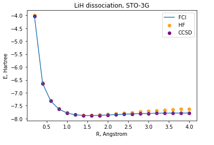
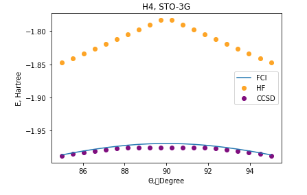
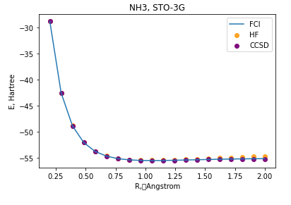
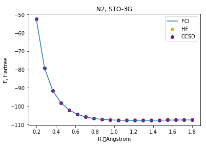

## Project 2: VQE
## Tasks and Challenges
For abstract technical results, please also refer to the [Business Application found here](./Business_Application.pdf)

### Step1
We have calculated geometry dependency for each of the 4 molecules. ([Notebook](S1_Classical_Methods_solution.ipynb))
 - LiH

 - H4

 - NH3

 - N2
 

### Step2
We have calculated effective Hamiltonian for each of 4 molecules and see reduction of qubit count as well as consistency of G.S. energy. ([Notebook](S2_Hamiltonian_gen_solution.ipynb))
 
### Step3
We have calculated G.S. energy for each of 4 molecules using FCI / UCCSD / QCC. ([Notebook](S2_Hamiltonian_gen_solution.ipynb))
- Selection of active orbitals greatly reduces Hamiltonian size / computational cost in 6-31G basis.
- Selection of entangular based on gradient amplitude for QCC.
- QCC speeds up 10~100x compared to UCCSD.
- Obtain optimized QCC parameters to be used in evaluation on QASM simulator / IBM-Q device.

### Step4
We have calculated qubit wise commuting groups for each of 4 molecules ([Notebook](S4_Measurement_solution.ipynb))
- Actual unitary calculation is almost intractable because of large qubit size required for each group. Only for H2 / H4, it can be calculated in reasonable time. 

### Step5
We have evaluated QCC's for each of 4 molecules and get consistent result in QASM simulator. IBM-Q device which can handle 8-qubits is not available now (in the weekend writing this report) because of "dedicated use". ([Notebook](S5_Circuits_solution.ipynb))

### Further Challenge

We have calculated energy of 1st excitation state of H2 using [SSVQE](https://arxiv.org/pdf/1810.09434.pdf). ([Notebook](exited_states.ipynb)).

## Business Application
Please refer to the [Business Application found here](./Business_Application.pdf)

